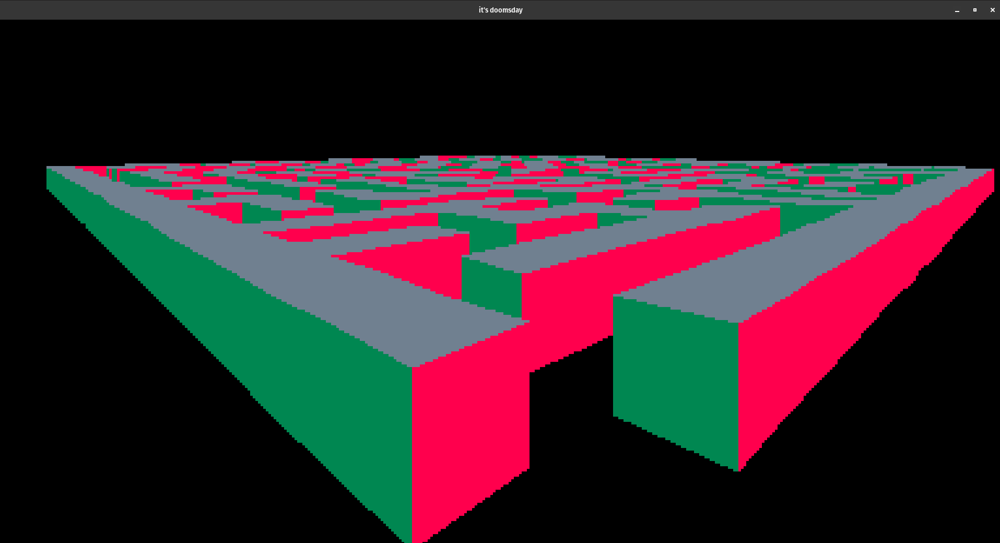
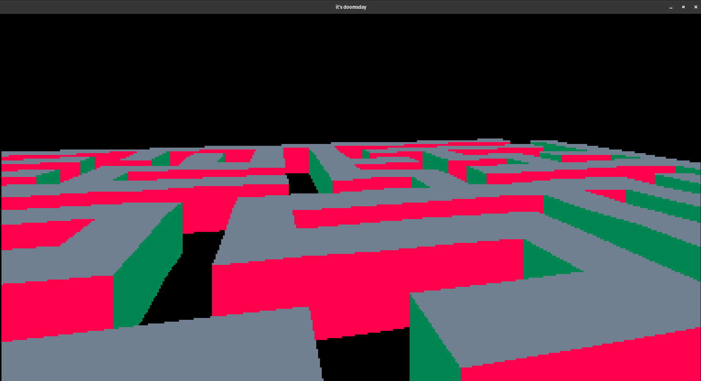

# CustomIdT1

Prototype of Id Tech 1 engine: move around in a pseudo-3D world, using x, y and z axis. <br>
Create a world more easily using a config file, an example is available below. <br>
The rendering is made up using Painter's algorithm. The graphics library is your choice thanks to a .so file.

## Compilation

```shell
make -C ./C # C Version
gcc tests/example.c -lcsfml-graphics -lcsfml-window -lcsfml-system
# or
make -C ./CPP # C++ Version, bin path is './CPP/idt1'
```

## Config file

```
<SHAPE> <POS x, y, z> <SIZE x, y, z>
```

- `<SHAPE>`: shape to create
  - `rectangle` <br>
`more to come!`

```
rectangle 50 30 0 10 10 10
```

# Pictures



